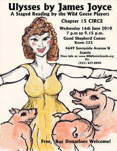
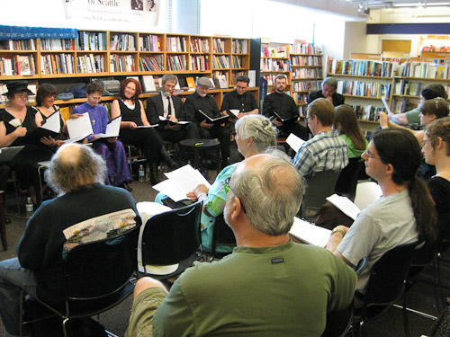

[![[Goose]](../../images/goose.gif)](../../index.html)

The Other Bloomsday - Seattle 2010
==================================

The Wild Geese Players of Seattle will present a staged reading of Part
II of chapter 15, "Circe", adapted from the 1922 edition of James
Joyce's *Ulysses*, on Wednesday, June 16th, 2010, 7:00-9:15pm, at the
[Good Shepherd
Center](http://www.historicseattle.org/projects/gsc.aspx), 4649
Sunnyside Avenue N, Seattle, WA 98103
([Map](http://maps.google.com/maps?f=q&source=s_q&hl=en&geocode=&q=4649+Sunnyside+Avenue+N,+Seattle,+WA+98103&sll=47.564626,-122.315652&sspn=0.010251,0.013797&ie=UTF8&hq=&hnear=4649+Sunnyside+Ave+N,+Seattle,+King,+Washington+98103&z=16)).
Donations towards costs of posters and props are welcome.

Stephen Dedalus and his friend Lynch, both very drunk, have entered
Nighttown, Dublin's red-light district, in search of female
companionship. Leopold Bloom, who has some paternal feelings for
Stephen, has followed them. A long chapter full of hallucinations and
nightmares, where Bloom confronts many of his unspoken desires and
emerges strengthened.

We had a very successful reading of the first half of this enormously
long chapter at the [University Bookstore last year](./2009.html). We
conclude the Circe chapter this year.

Note: this chapter is intended for an adult audience. Bloom will be
excoriated and sexually humiliated by the Circe character.

Further background information on the Circe chapter can be found at the
[Kennesaw guide to
Ulysses](http://ksumail.kennesaw.edu/~mglosup/ulysses/circe.html) and
[the Joyce
portal](http://www.robotwisdom.com/jaj/ulysses/index.html#circe). Or
[read the text of the chapter
here](http://www.readprint.com/chapter-6376/James-Joyce).

We encourage you to download Ellen Coyle's [Circe
poster](../../Circe2-Poster/Circe2-Poster.pdf "Circe Poster") (PDF,
1.3MB) and post it around town.

2009 Program Notes
==================

The meaning of Circe
--------------------

The structure of James Joyce’s Ulysses is loosely based on **Homer’s
Odyssey**, in which the hero Odysseus wandered around the ancient
Mediterranean for decades longing to get home to his wife Penelope.
Joyce’s Odysseus/Ulysses is **Leopold Bloom**, a slightly pathetic
jewish Everyman wandering around his native **Dublin** on **June 16th**
1904. He feels bad because his wife **Molly** is being unfaithful and
their marriage has been sexless for many years, since their baby son
**Rudy** died. At the end of the previous chapter, [Oxen of the
Sun](./2008.html), Bloom felt protective and fatherly towards **Stephen
Dedalus**, the son of a friend.

In **Homer’s Circe** episode, **Odysseus** maintains his wits and uses
the herb moly as advised by the god Hermes to avoid being unmanned
during his seduction by the goddess Circe who has enticed his men with
song and feasting before transforming them into pigs. She falls in love
with Odysseus, reverses the spell on his men and they feast for a year
before she helps them on their way home.

The Circe story above inspires Joyce’s schema for his chapter, which
includes **magic, whore, hallucination, man-hating ogress, and
personification**. A major theme is that sexuality degrades men to the
level of dumb unconscious swine… note the multiple references to pigs.
The Homeric transformation to pigs may actually refer to anticholinergic
intoxication, producing amnesia, hallucinations, and delusions, and
counteracted by the snowdrop flower, fitting the description of moly.
There are some references to Bloom being womanly, hinting at the overt
gender transformations in the second half of the chapter **Joyce’s usual
multitude of voices** are relatively easy to discern because the text is
written like a **play**, though depiction of the many hallucinatory
sequences and extreme transformations would require ultramodern
animation techniques.

**2009 Reading**\
 Tina Bonfield, Loxy Baltazar, Wendy Joseph, Helen Brew, Mark Gunning,
Bill Barnes, Matt Muldoon, George Reilly, Leon Mattigosh.

Just as Odysseus rescued his men, Bloom survives many things that could
“unman” him and eventually at the end of the chapter **succeeds in
helping Stephen**, an important step towards **regained manhood and
fatherly potency**. On another level, this bodes well for **Ireland’s
future** because James Joyce (father, Leopold Bloom, realist) wants the
future Ireland (son, Stephen Dedalus, the Irish literary renaissance) to
be manly and powerful and good and uncorrupt. Joyce hates how Irish
people are made impotent by British rule (Bloom the cuckold) but worries
that nationalism is crippled by racism (the Citizen), consumerism,
sentimentalism (Gerty) and hypocrisy (priests, socialites).

The Circe chapter is also a recapitulation of **Freudian
psychoanalysis**, representing Bloom’s **descent into his
unconscious**/dreams (pig mind) where various demons, vices and
psychiatric symptoms are confronted, named, and purged, and he overcomes
unconscious guilt that has paralyzed his volition. It is also a ritual
of confession and a crazy epiphany and a cathartic comedy where anything
is possible. Stephen Dedalus undergoes a parallel journey confronting
his own demons (in the second half of the chapter).

The plot of this year’s chapter, Circe
--------------------------------------

The action begins at **midnight** in “Nighttown”, Joyce’s term for the
red light district of Dublin, where time and space are warped with a
theatrical hallucinatory tinge.

Stephen and his friend Lynch arrive. Stephen is drunk and joyously
perverts religious quotes (chooses sex over religion). Bloom has
followed Stephen to Nighttown, paternalistically worried he will be
corrupted and lose his money. Bloom narrowly escapes being run over by a
trolley, but it cures his stitch (spear in Christ’s side). He buys some
pigbits (chooses pork over religion). (Ergo, **sex=pork**). He imagines
being mildly criticized by his late parents, Molly/Marion his wife, and
Gerty with whom he “flirted” earlier **(anxiety)**.

Bloom snaps back to reality when he meets Mrs Breen his old flame, and
they have fun flirting and sharing memories. While Bloom is accosted by
British soldiers, he imagines being put on trial and accused of sexual
harassment by a maid, and several posh Dublin women, then a jury of his
“peers” appears and he is sentenced to hang **(paranoia)**. The dog who
has been sniffing the pork and transforming its breed every minute
(psychosis?) becomes the ghost of Paddy Dignam whose funeral Bloom
attended that morning.

Bloom walks on and meets Zoe who confirms Stephen is upstairs in the
brothel. Bloom’s anti-smoking comment to Zoe evolves into a political
scene where he is idolized **(delusions of grandeur)**. When this turns
sour, people call for Bloom’s downfall or excuse him on grounds of his
sexual abnormalities, his race, and the fact he is about to give birth.

Zoe “reappears” and escorts Bloom into the brothel, prompting Stephen to
allude to judgement day. Many inanimate objects speak
**(schizophrenia)**. An evangelist/prophet Elijah and Bloom’s grandpa
Virag appear and criticize. Bloom’s romantic alter-ego Henry Flower also
appears. Throughout, Bloom retains his sanity and composure amidst
hallucinations and transformations and the **animalistic fleshpot
atmosphere**, helped by his **lucky potato** (moly) as well as his
relative sobriety and outsider’s perspective.

In the **second half** of the chapter, which **we will read in 2010**,
Bloom meets his Circe, the brothel madam, Bella Cohen, and survives
exceedingly humiliating interactions with her. The chapter will end with
some crucial turning points within the Ulysses storyline. First, Stephen
**rejects religious hypocrisy and guilt** when he ends a vision of his
dead mother’s ghost by **smashing a chandelier**. Next, Bloom
**overcomes his paralysis** and begins to fulfill his paternal urges
when he intervenes to prevent Stephen from being overcharged for the
breakage by Bella, and to curtail Stephen’s beating by British soldiers.
This helps to assuage Bloom’s eternal sadness over Rudy, and more
grandly implies Ireland will regain power to father its own rosy future.

Other Events
------------

See our [archives](../../archives.html) for details of our previous
readings.
