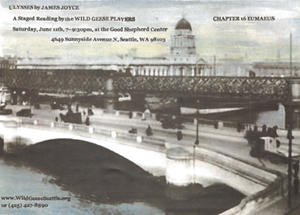

[![[Goose]](../../images/goose.gif)](../../index.html)

The Other Bloomsday - Seattle 2011
==================================

The Wild Geese Players of Seattle will present a staged reading of
Chapter 16, “Eumaeus”, adapted from the 1922 edition of James Joyce's
*Ulysses*, on Saturday, June 11th, 7–9:30pm, at the [Good Shepherd
Center](http://maps.google.com/maps/place?cid=7930079675223594474), 4649
Sunnyside Avenue N, Seattle, WA 98103. Donations towards costs of room
rental, posters, and props are welcome.

We had a very successful reading of the second half of the enormously
long Circe chapter at the [Good Shepherd Center last year](./2010.html).
We continue with the Eumaues chapter this year.

Eumaeus
-------

In the previous chapter, [Circe](./2010.html), Leopold Bloom accompanied
a very drunken Stephen Dedalus to a Dublin brothel, a trip that ended in
Stephen hallucinating seeing the ghost of his mother and being knocked
out in a fight with a British soldier.

Now, Bloom takes Stephen to a nearby cabman's shelter to get a cup of
coffee. The shelter has a handful of motley inhabitants, including the
keeper, one Skin-the-Goat Fitzharris, and D.B. Murphy, an old sailor and
unreliable spinner of tales.

Read the [text of the chapter
here](http://www.readprint.com/chapter-6377/Ulysses-James-Joyce).

Some commentary on the Eumaues chapter:

-   [Kennesaw
    Guide](http://ksumail.kennesaw.edu/~mglosup/ulysses/eumaeus.htm)
-   [The Modern Word](http://www.themodernword.com/joyce/)
-   [The Joyce
    Portal](http://www.robotwisdom.com/jaj/ulysses/index.html#eumeus)
-   [The Sheila Variations](http://www.sheilaomalley.com/?p=7631)
-   [Joyce Images](http://www.joyceimages.com/chapter/16/)
-   [Paul
    Debraski](http://ijustreadaboutthat.wordpress.com/2010/08/23/james-joyce%E2%80%93week-7-ulysses-1922-eumaeus-ithaca/)
-   [Stockton](http://loki.stockton.edu/~kinsellt/projects/ulysses/storyReader$52.html)

We encourage you to download Ellen Coyle's [Eumaeus
poster](../../posters/2011-Eumaeus-Poster.pdf "Download Eumaeus Poster")
(PDF, 650KB) and post it around town.

Other Events
------------

See our [archives](../../archives.html) for details of our previous
readings.
