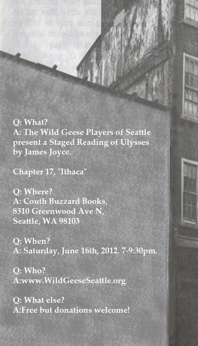

[![[Goose]](../../images/goose.gif)](../../index.html)

The Other Bloomsday - Seattle 2012
==================================

The Wild Geese Players of Seattle will present a staged reading of
Chapter 17, “Ithaca”, adapted from the 1922 edition of James Joyce's
*Ulysses*, on Saturday, June 16th, 7–9:30pm, at [Couth Buzzard
Books](http://buonobuzzard.com/main.htm), 8310 Greenwood Ave N, Seattle,
WA 98103. Donations towards costs of room rental, posters, and props are
welcome.

We had a successful reading of the Eumaeus chapter [last
year](./2011.html). We continue with the Ithaca chapter this year.

Ithaca
------

In the previous chapter, [Eumaeus](./2011.html), Leopold Bloom took a
very drunken Stephen Dedalus to a cabman's shelter to sober up over a
cup of coffee.

Bloom returns home to 7 Eccles Street with Stephen, around 2AM. The two
men discuss a wide variety of topics. The episode is written in the form
of a rigidly organized catechism, and was reportedly Joyce's favorite
episode in the novel. The style is that of a scientific inquiry, with
questions furthering the narrative. The deep descriptions range from
questions of astronomy to the trajectory of urination.

Read the [text of the chapter
here](http://www.readprint.com/chapter-6378/Ulysses-James-Joyce).

Some commentary on the Ithaca chapter:

-   [Kennesaw
    Guide](http://ksumail.kennesaw.edu/~mglosup/ulysses/ithaca.htm)
-   [The Modern Word](http://www.themodernword.com/joyce/)
-   [The Joyce
    Portal](http://www.robotwisdom.com/jaj/ulysses/index.html#ithaca)
-   [The Sheila Variations](http://www.sheilaomalley.com/?p=7637)
-   [Joyce Images](http://www.joyceimages.com/chapter/17/)
-   [Paul
    Debraski](http://ijustreadaboutthat.wordpress.com/2010/08/23/james-joyce%E2%80%93week-7-ulysses-1922-eumaeus-ithaca/)

We encourage you to download Ellen Coyle's [Ithaca
poster](../../posters/ithaca-poster.pdf "Download Ithaca Poster") (PDF,
1.3MB) and post it around town.

Other Events
------------

See our [archives](../../archives.html) for details of our previous
readings.
