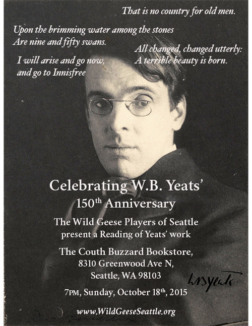

W.B. Yeats' 150th Anniversary Reading
=====================================

2015 is the 150th anniversary of the birth of William Butler Yeats, one
of Ireland's greatest poets. In his honor, the Wild Geese Players of
Seattle will present a [reading of Yeats'
work](./Yeats/2015/150-reading.html "Yeats 150").

Location
--------

[Couth Buzzard Bookstore](http://www.buonobuzzard.com/),\
 8310 Greenwood Ave N,\
 Seattle, WA 98103.\
 7pm, Sunday, October 18th, 2015.

Please RSVP to our [Facebook
event](https://www.facebook.com/events/751026308353946/).

Program
-------

The program will include readings from

-   Easter 1916
-   The Lake Isle of Innisfree
-   The Wild Swans at Coole
-   Sailing to Byzantium
-   Song of Wandering Aengus

and more.
