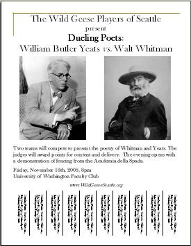

![[Goose]](./images/goose.gif)

  -----------------------------------------------------------------------------------------------------------------------------------
  
  
  -----------------------------------------------------------------------------------------------------------------------------------

Dueling Poets
=============

Press Release

The Wild Geese Players of Seattle present a fun-filled evening of
Dueling Poets!

Nobel prize winner William Butler Yeats' verses will compete with the
verse of New World pretender, Walt Whitman! The Yeats team is in the
capable hands of Dramaturg Ciaran O'Mahony, and includes Bill Barnes,
Lynn Carrigan, Joe Martin, and George Reilly, and Helen Anne ?. The
plucky Whitman team Dramaturg is Scott Mc Kinstry, aided by Michael
Green, Nancy Mills, Kieran O'Malley, Emma Bartholomew, and A.N. Other!!

The poetry and dramatic presentations will be judged by an estimable
panel of experts led by Frank Maloney.

We have invited fencers from the Academia della Spada to begin the event
with a dueling demonstration. The Academia della Spada, formed in
Seattle in 1999 by Academy Master Cecil Longino, teaches 16th century
sword-fighting techniques from early fighting manuals and treatises. For
more information on their rapier and backsword curricula and classes,
see their website at
[www.academiadellaspada.com](http://www.academiadellaspada.com/).

All this, and more, will take place on:

Friday November 18th at 8pm\
 University of Washington Faculty Club,\
 Colleen Rohrbaugh room (formerly Music room)
[(Map)](http://www.washington.edu/home/maps/northcentral.html?FAC "Map of UW Campus")
(Park in N6).

Pre-show musical entertainment by Lyndol Pullen!

Post-show reception, with Guinness, Harp, Irish coffee, and craic!

Donations for the Wild Geese will gratefully be accepted at the door

Feel free to download and post our [flyer](./DuelingPoets.pdf "Flyer")
(1.1MB). You may need to download the free [Adobe Acrobat
Reader](http://www.adobe.com/products/acrobat/readermain.html "Get Adobe Reader")
to print the flyer.
