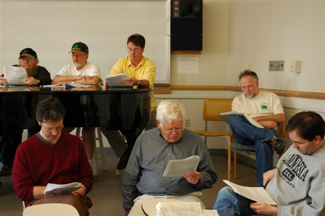

[![[Goose]](../../images/goose.gif)](../../index.html)

The Other Bloomsday - Seattle 2007
==================================

James Joyce's novel *Ulysses* takes place on June 16th, 1904. It follows
the wanderings of Leopold Bloom, a Jewish everyman, and Stephen Dedalus,
a young writer and Joyce's *alter ego*, as they wander the streets of
Dublin.

The centenary of [Bloomsday](http://en.wikipedia.org/wiki/Bloomsday),
June 16th, 2004, was celebrated
[worldwide](http://www.rejoycedublin2004.com "ReJoyce Dublin 2004").

The Wild Geese Players of Seattle will present a staged reading of
chapter 13, "Nausikaa", adapted from the 1922 edition of *Ulysses*. The
reading will take place at the [Elliott Bay
Bookstore](http://www.elliottbaybook.com/events/jun07/geese.jsp), 101 S.
Main St, on Sat 16th June 2007 at 4:30pm, and at the [Pike Brewery and
Pub](http://www.pikebrewing.com/), 1415 First Ave, on Sun 17th June at
6pm.

Listen to us reading excerpts from the chapter on *Sunday's Hornpipe* on
[KBCS 91.3](http://kbcs.fm/), on Sunday, June 10th, between 3-6pm.

Leopold Bloom, newly escaped from Barney Kiernan's pub, reposes on
Sandymount Beach, exchanging meaningful glances with Gerty MacDowell.

2005 Rehearsal.\
 Back: Joe Martin, Bill Barnes, Joseph Ryan, Ciaran O'Mahony.\
 Front: Niall McDonnell, Jim McDermott, Scott McKinstry.

Entrance is free, but donations are appreciated.

Further background information on the Nausikaa chapter can be found at
the [Kennesaw guide to
Ulysses](http://ksumail.kennesaw.edu/~mglosup/ulysses/nausicaa.htm) and
[the Joyce portal](http://www.robotwisdom.com/jaj/ulysses/notes13.html).
Or [read the text of the chapter
here](http://www.readprint.com/chapter-6374/James-Joyce).

Other Events
------------

See our [archives](../../archives.html) for details of our previous
readings.
