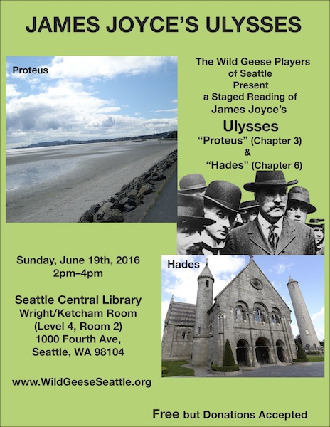

Title: The Other Bloomsday - Seattle 2016
Date: 2016-04-30 12:00
Category: 2016

The Wild Geese Players of Seattle will present a staged reading of
Chapter 3, “Proteus”, and Chapter 6, “Hades”,
adapted from the 1922 edition of James Joyce's *Ulysses*,
on June 19th, 2016.

Our annual Bloomsday readings started in 1998.
We started afresh two year ago, with the chapters that introduce
the two primary characters of the book,
Stephen Dedalus in Chapter 1 and Leopold Bloom in Chapter 4.
We continued that pattern last year, interweaving Chapters 2 and 5.
This year, we're continuing with Chapter 3, “Proteus”, and Chapter 6, “Hades”.

## Chapter 3: Proteus

In Chapter 3, Stephen Dedalus has wandered down to Sandymount Strand
(the beach at the southeast side of Dublin) to stroll and to think.
He contemplates different theories of vision, Aristotle's in particular,
and remembers his adventures in Paris before his mother died.

## Chapter 6: Hades

Meanwhile, in Chapter 6 we join the funeral of Paddy Dignam,
with Leopold Bloom sharing a carriage with Simon Dedalus (father of Stephen)
and others to Glasnevin cemetery.
As the carriage moves past Watery Lane,
Bloom sees Stephen and points him out to Simon.
Bloom's Jewish parentage makes him an outsider to the Catholics in the cab,
and the conversation takes some awkward turns.

## Reading at the Seattle Central Library

**2pm–4pm** on **Sunday, June 19th, 2016**,  
[The Seattle Central Library](https://www.spl.org/hours-and-locations/central-library),  
Level 4, Room 2 — Howard S. Wright Family & Janet W. Ketcham Meeting Room,  
1000 Fourth Ave,  
Seattle, WA 98104  

[Map](https://maps.google.com/maps?q=1000+Fourth+Avenue,+Seattle,+WA+98104).

Donations towards costs of posters and props are welcome.
Please arrive before 2pm to find a seat.
The reading will take roughly 90 minutes.

Please RSVP to our [Facebook event](https://www.facebook.com/events/650261501793825/).

## Poster

We encourage you to download Leon Mattigosh's
[Proteus/Hades poster](../../posters/2016-proteus-hades.pdf "Download Proteus/Hades Poster")
(PDF, 1.7MB) and post it around town.

## Press Release

This is our nineteenth year of Bloomsday readings.
[(Press Release)]({filename}2016/press-release.md).

## Commentary

### Proteus (Chapter 3)

-   [Text of Chapter 3](http://www.online-literature.com/james_joyce/ulysses/3/)
-   [Kennesaw Guide](http://web.archive.org/web/20120618124805/http://ksumail.kennesaw.edu/~mglosup/ulysses/proteus.htm)
-   [Cliff Notes](http://www.cliffsnotes.com/literature/u/ulysses/summary-and-analysis/chapter-3)
-   [Sparknotes](http://www.sparknotes.com/lit/ulysses/section3.rhtml)
-   [The Joyce Portal](http://web.archive.org/web/20130409060521/http://www.robotwisdom.com/jaj/ulysses/index.html#proteus)
-   [The Sheila Variations](http://www.sheilaomalley.com/?p=7550)
-   [Joyce Images](http://www.joyceimages.com/chapter/03/)
-   [Paul Debraski](http://ijustreadaboutthat.wordpress.com/2010/07/12/james-joyce-week-1-ulysses-1922/)
-   [Shmoop Summary](http://www.shmoop.com/ulysses-joyce/episode-3-proteus-summary.html) and [Analysis](http://www.shmoop.com/ulysses-joyce/proteus-analysis-summary.html)
-   [Groden Notes](http://www.michaelgroden.com/notes/open03.html)
-   [Joyce’s Moraculous Sindbook: Suzette Henke](https://ohiostatepress.org/Books/Complete%20PDFs/Henke%20Joyces/05.pdf)

### Hades (Chapter 6)

-   [Text of Chapter 6](http://www.online-literature.com/james_joyce/ulysses/6/)
-   [Kennesaw Guide](http://web.archive.org/web/20120614235446/http://ksumail.kennesaw.edu/~mglosup/ulysses/hades.htm)
-   [Cliff Notes](http://www.cliffsnotes.com/literature/u/ulysses/summary-and-analysis/chapter-6)
-   [Sparknotes](http://www.sparknotes.com/lit/ulysses/section6.rhtml)
-   [The Joyce Portal](http://web.archive.org/web/20130409060521/http://www.robotwisdom.com/jaj/ulysses/index.html#hades)
-   [The Sheila Variations](http://www.sheilaomalley.com/?p=7570)
-   [Joyce Images](http://www.joyceimages.com/chapter/06/)
-   [Paul Debraski](http://ijustreadaboutthat.wordpress.com/2010/07/19/james-joyce%E2%80%93week-2-ulysses-1922/)
-   [Shmoop Summary](http://www.shmoop.com/ulysses-joyce/episode-6-hades-summary.html) and [Analysis](http://www.shmoop.com/ulysses-joyce/hades-analysis-summary.html)
-   [Groden Notes](http://www.michaelgroden.com/notes/open06.html)
-   [Joyce’s Moraculous Sindbook: Suzette Henke](https://ohiostatepress.org/Books/Complete%20PDFs/Henke%20Joyces/07.pdf)

### Miscellaneous

-   [The Modern Word](http://web.archive.org/web/20150423131232/http://www.themodernword.com/joyce/)
-   [James Joyce's Ulysses: Where It's Always June 16, 1904](http://loki.stockton.edu/~kinsellt/projects/ulysses/ulysses.html)
-   [Ulysses AudioBook](http://archive.org/details/Ulysses-Audiobook)

## Other Events

See our [archives]({filename}/archives.html) for details of our previous readings.
