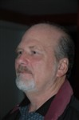
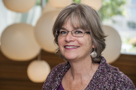
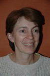
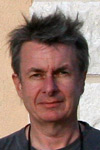
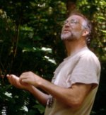
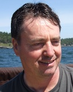

The Players
===========

Originally, the [Flight of the Wild
Geese](http://en.wikipedia.org/wiki/Flight_of_the_Wild_Geese) referred
to thousands of Irish soldiers who were exiled to France after the
Treaty of Limerick in 1691. For generations, their descendants served in
the Irish Brigades in the French army, fighting against England.

The [Wild Geese Heritage Museum](http://indigo.ie/~wildgees/index.htm)
of Portumna, Co. Galway has a large collection of Wild Geese material.

More generally, the term "Wild Geese" has become synonymous with the
[Irish diaspora](http://en.wikipedia.org/wiki/Irish_diaspora).

The Wild Geese Players of Seattle are a diverse group of people who
share a common interest in Irish literature. Some of us were born in
Ireland, some of us are of Irish descent, and some of us are honorary
Irish!

Here are past and current members of the Players.

* * * * *

### Bill Barnes

WD "Bill" Barnes is married to the former Maura Boyle of Belfast. A
native of Seattle, he is a long-standing member of the Irish-American
community. He has a Masters in English from Seattle University and has
published poetry and appeared in other Irish theater productions in the
past. He is also exactly one-half of the musical group, the "Emerald
Bards". To earn his bread, he is a salesman in the communications
industry.

* * * * *

### Emma Bartholomew

Emma Bartholomew has a degree in Comparative Literature from Scripps
College. After a stint in the Air Force, she moved to Seattle in 1987.
She has had a varied career and now works as a software tester. 2008
marks her fifth year with the Players. She is married to [George
Reilly](#George-Reilly).

**2008: door**

* * * * *

### Don Berg

Born Shaun Liam Kelly, Don Berg has been a member of the Wild Geese
since 2001, though he missed 2003's production while on active duty for
the Global War on Terror. In real life he works at UW School of Nursing
and is a Naval Reserve Officer. As a denizen of the local art scene, Don
has appeared in local theater production and local and regional TV ad
commercial productions.

* * * * *

### Olivia Bermingham-McDonogh

Olivia Bermingham-McDonogh was born in Tuam, Co. Galway and came to the
USA for graduate school at UCLA. Other than the required school plays,
she has never performed in anything other than the annual Bloomsday
reading of Ulysses. She is a Research Assistant Professor at the
University of Washington; her research area is development and
regeneration of the inner ear. She has now spent half her life in the US
and wonders if she will ever find her way back home!

* * * * *

### Tina Bonfield

in seattle was a stage manager for the DAMN group, of local playwrights;
putting on two productions a year, for 3 years. Have been involved with
the Geese, for about 5 year? in production,front of house and small
parts. I work as a caregiver,full time.

**2008: Nurse Callan, Nurse Quigley, Barman**

* * * * *

### Helen Brew

Helen Brew has performed with the Wild Geese Players since June 2000
(which was chapter 4). In her youth she was an avid reader and artist,
though she fitted in bits of acting, stage writing, directing, theatre
design and choral performance. Her paid work has included writing a book
on compost, and doing neuroscience research (UW). She's English, but has
some Irish ancestry she tries to play up. She directed 2007's reading.

* * * * *

### Ellen Coyle

Ellen Coyle is an Irish artist living and working in Seattle. She
attended the National College of Art and Design in Dublin, the Cooper
Union in New York and completed the Scientific Illustration program at
the University of Washington in 2004. She is currently working on
several projects which explore the landscapes we live in, and the myths
we create about them.

* * * * *

### Maura Donegan

Maura Donegan has lived in Seattle for the last six years. This is her
first reading, although she was involved with the original Wild Geese
(Edmonton) assisting with costumes. Her interests include textiles and
embroidery. Maura is from Ireland. She has three children whom she
educated at home.

**2008: Narrator \#3**

* * * * *

### Iain Edgewater

Iain Edgewater was raised on the fringes of Appalachia in Kentucky, and
was first exposed to Joyce in boyhood, strangely, through science
fiction. After years of reading Ulysses in bits and pieces, he finally
read it straight through while living in Hanoi, Vietnam, in 1992--a very
good time and place for the task. Like many trained in anthropology, he
does not work as an anthropologist; instead, he is now one of the people
involved with occasionally rebooting your computer in the middle of the
night, if you happen to use a rather well-known operating system. After
much time threatening to begin writing fiction (concurrent with early
dabbling in acting, and later involvement in radio), he is finally doing
so, and is thus pleased to have finally begun reading with the WGP in
this cycle--since the shadow of Joyce looms large over his efforts.

* * * * *

### Claudia Finn

Claudia’s Irish ancestors came to the U.S. in 1872 (!). A theatre buff,
Francophile, and James Joyce fan, she joined the Wild Geese in 2008.
After a career writing, producing, and directing corporate videos,
multimedia, and print, she taught college courses in business and
technology. Since moving to Seattle in 2003, she works as a technical
trainer, training developer, writer and editor.

**2008: Narrator \#1**

* * * * *

### Mark Gunning

Mark Gunning, was born and reared in Dublin (more than half a century
ago) and has lived in the US for two decades, moving to Washington in
2004. He studied Medicine in Trinity College Dublin, and researched and
practiced nephrology in Boston and New Mexico before coming to the
Northwest. 2008 will be his first reading with the Wild Geese.

**2008: Vincent Lynch**

* * * * *

### Red Johnston

A native of Limerick, Redmond fled the city a few brief centuries after
Sarsfield. A true wild goose, the exile toiled years in the service of
far-flung potentates....B.B. Hindowa IV of Ngelehun-Badjia, Habib
Bourguiba, Mohamed Reza Pahlavi, Fahd bin Abdulaziz Al Saud, Bill
Gates... 2008 is his twenty-second year of refuge in East Ballard, w.
his Anglo-Danish wife and surviving children.

**2008: Leopold Bloom**

* * * * *

### Wendy Joseph

Wendy Joseph has spent thirty years in theatre, having first directed
*The Merchant of Venice* in college. She is an author of fiction and
non-fiction, and a published and award-winning poet. Her plays
*Gargoyles*, *Booking Hold*, *The Hamlet Interview* and *Oil in the
Sound* have been produced in Seattle. She has played the Nurse, the
Chorus and the Prince in *Romeo and Juliet*, appeared in the movie
*Singles*, and played Garryowen the Dog and Gertie MacDowell in the Wild
Geese Players' previous Ulysses readings. She holds Masters degrees in
English from UCLA (Thesis: *Yeats and the Ancient Irish Poets*) and the
UW, where she studied Joyce's Ulysses with renowned Celtic scholar
Hazard Adams. She has crewed the tall ship Lady Washington, the Virginia
V, a WWII freighter, and cargo ships the world over, from the Strait of
Gibraltar to Singapore. In 2006, she won First Prize at the Seattle
Maritime Festival's "Songs and Stories of the Sea" contest.

**2008: N2, publicity**

* * * * *

### Mary Kelly

Mary Kelly hails from Cork City, Ireland, and has been living in Seattle
since 1989. She is a presenter of the popular Celtic music radio program
"Sunday's Hornpipe" which broadcasts from the Bellevue Community College
station [KBCS 91.3 fm](http://kbcs.fm/). Her interests include
set-dancing, choral singing and travel. She works as an administrative
coordinator for the Dean of the College of Science and Engineering at
Seattle University.

* * * * *

### Bill Kuhn

Bill joined the Wild Geese in the 2006 season, and is directing the 2008
reading of Oxen of the Sun. Bill was raised on the east coast, but has
lived in the Montlake neighborhood of Seattle with his wife, Pat, since
1980. He has recently retired from the technology business, and is
concentrating his efforts on photography and travel.

**2008: director, Malachi Mulligan**

* * * * *

### Joe Martin

Joe Martin has served the low-income and homeless community of downtown
Seattle since 1977. Much of that time has been spent at the Pike Market
Clinic of which he is a founder. He has advocated politically for the
needs of the poor and marginalized, particularly in the area of housing.
For over twenty years, Joe has performed Irish music at pubs, weddings,
and other venues as a member of Claypipe. He is married to Martha
Rowland and is the father of John Patrick, 17, and Brendan Thomas, 15.

* * * * *

### Leon Mattigosh

Leon Mattigosh has been performing and studying performance in Seattle
for 30 years. He is a member of the Red Earth Performing Arts theater
group. Leon's most memorable roles have been in Susan Simpson's MOLINE
and Bruce Miller's northwest native creation epic CHANGER. most
recently, Leon was seen in Lucia Neare's LULLABY CARRIAGE and as a
member of Seattle Novyi Theater's year long repertory of Chekhov's THE
SEAGULL and UNCLE VANYA. Leon is an enrolled member of the Lac Du
Flambeau Band of Lake Superior Chippewa Indians. Leon is confident that
having taken part in a reading of Joyce's ULYSSES, he will go straight
to hell.

**2008: Punch Costello**

* * * * *

### Scott McKinstry

Scott McKinstry is a graduate of the Central School of Speech and Drama
in London. In addition to performing with his own Shakespeare company,
The Mirror Players in Colorado, he has acted with The Denver Center
Theatre Company, Studio Arena, Germinal Stage, and the Royal Shakespeare
Company.

* * * * *

### Matt Muldoon

* * * * *

### Ciaran O'Mahony

Ciaran O'Mahony came to Seattle from Kinsale in Co. Cork, from where
after the battle in 1601, the original Flight of the Earls set out! He
is currently a doctoral student at the University of Washington College
of Education, from where he wishes to learn Americans how to speak
English with the proper Cork intonation. He is convinced that if Joyce
was deaf and Beethoven blind, the world would be easier to understand
today.

* * * * *

### Kieran O'Malley

Kieran D. O'Malley is the founder and former Artistic Director of the
Wild Geese Players of Seattle. He was born in Belfast where his parents
Mary and Pearse founded the Lyric Players Theatre in 1951. He entered
drama school at age 7 years and has never looked back! His first
theatrical brush with Joyce was over 40 years ago when he watched his
mother and Denis Johnson direct The Voice of Shem (Mary Manning's
adaptation of Finnegan's Wake). He is a member of the Literary Managers
and Dramaturges of the Americas.

He is back working in Belfast since 2006 and is a consultant in
adolesent Psychiatry working with the youth of Belfast ( that would 'do
yer head in'!!). He has also re-connected with the Lyric theatre and is
now in the process of a new building to house 2 theatres, 400 seat and
100 seat!

**2008: Madden, Dowie**

* * * * *

### Lyndol Pullen

Lyndol Pullen was born in Idaho and has lived in Seattle for many years.
He is a retired printer and an enthusiastic musical arranger and
pianist.

* * * * *

### George V. Reilly

George V. Reilly grew up in Dublin and moved to Seattle in 1992. He has
degrees in Computer Science from Trinity College Dublin and Brown
University, and works as a software developer. He first tried---and
failed---to read Ulysses on the centenary of Joyce's birth in 1982. He
joined the Players in 2003. George is married to [Emma
Bartholomew](#Emma-Bartholomew)

George is the webmaster for this site. He can be contacted at
[www.georgevreilly.com](http://www.georgevreilly.com/).

**2008: script wrangler, Stephen Dedalus, Bystander**

* * * * *

### Joseph Ryan

Joseph grew up in Dublin and moved to Nenagh in Tipperary for high
school. He attended University College in Dublin and later emigrated to
Edmonton in 1981. While in Canada he was a member of the original Wild
Geese with Kieran O'Malley where he supported front of house operations
and played rugby with the 'Geese. After a five year return to Wexford he
emigrated again, this time to Seattle in 1998. Eventually he caught up
with the Wild Geese and Kieran O'Malley and attended several of the
annual Ulysses' readings before he was roped in for reading in 2008. He
has really enjoyed reading several parts including Lenehan and Bloom a
couple of times. Joseph, an engineer, has no other thespian experience
and sincerely hopes it does not show too much!

**2008: Lenehan**

* * * * *
