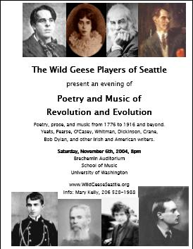

![[Goose]](./images/goose.gif)

  -----------------------------------------------------------------------------------------------------------------------------------
  
  
  -----------------------------------------------------------------------------------------------------------------------------------

Poetry and Music of Revolution and Evolution
============================================

The Wild Geese Players of Seattle will present an evening of "Poetry and
Music of Revolution and Evolution" on Saturday, November 6th, 2004 at 8
pm, at the Brechemin Auditorium, School of Music, University of
Washington. Donations at the door.

The evening will incorporate poetry, prose, and music from 1776 to 1916
and beyond, including excerpts from works by
[W. B. Yeats](./Yeats/index.html), Pádraic Pearse, Seán O'Casey, Emily
Dickinson, Walt Whitman, Stephen Crane, Bob Dylan, and other writers,
both Irish and American.

The thrust of the evening is inspired by these lines from an address by
President John F. Kennedy, given at Amherst College Convocation on
October 26th, 1963, one month before he died:

> "When power leads man towards arrogance, poetry reminds him of his
> limitations. When power narrows the area of man's concern, poetry
> reminds him of the richness and diversity of existence"

These are times that will be remembered for many years to come, and we
all have an opportunity to acknowledge their importance and reflect on
their legacy for America and for the world.

Kieran Darragh O'Malley\
 Artistic Director

For further information, contact: Mary Kelly, Publicity (206) 528-1988,
[mpkelly@seattleu.edu](mpkelly@seattleu.edu).

Feel free to download and post our [flyer](./rEvolution.pdf "Flyer").
You may need to download the free [Adobe Acrobat
Reader](http://www.adobe.com/products/acrobat/readermain.html "Get Adobe Reader")
to print the flyer.
